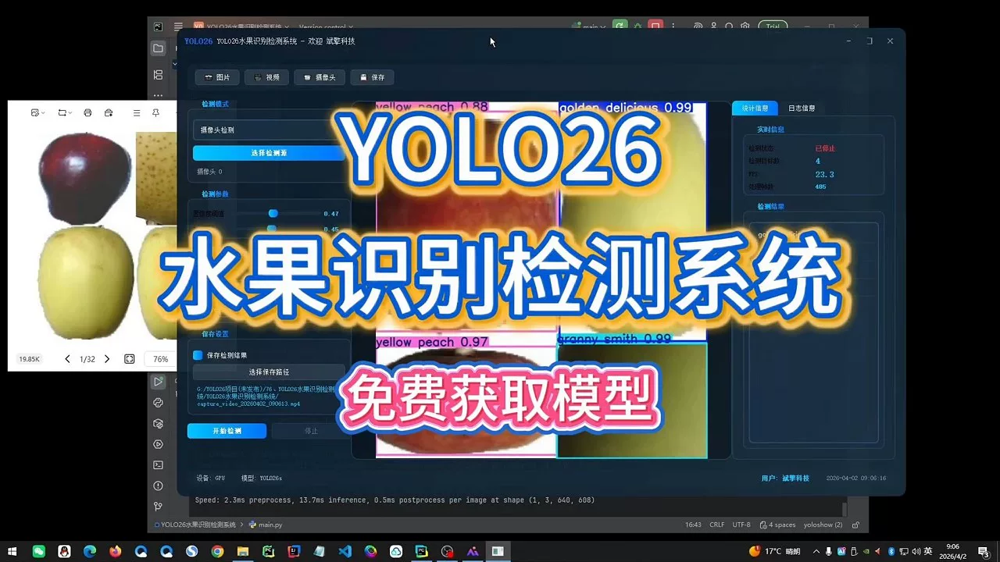
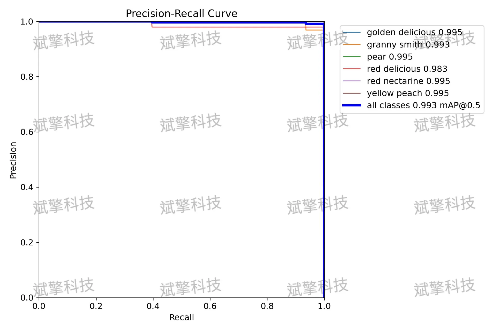
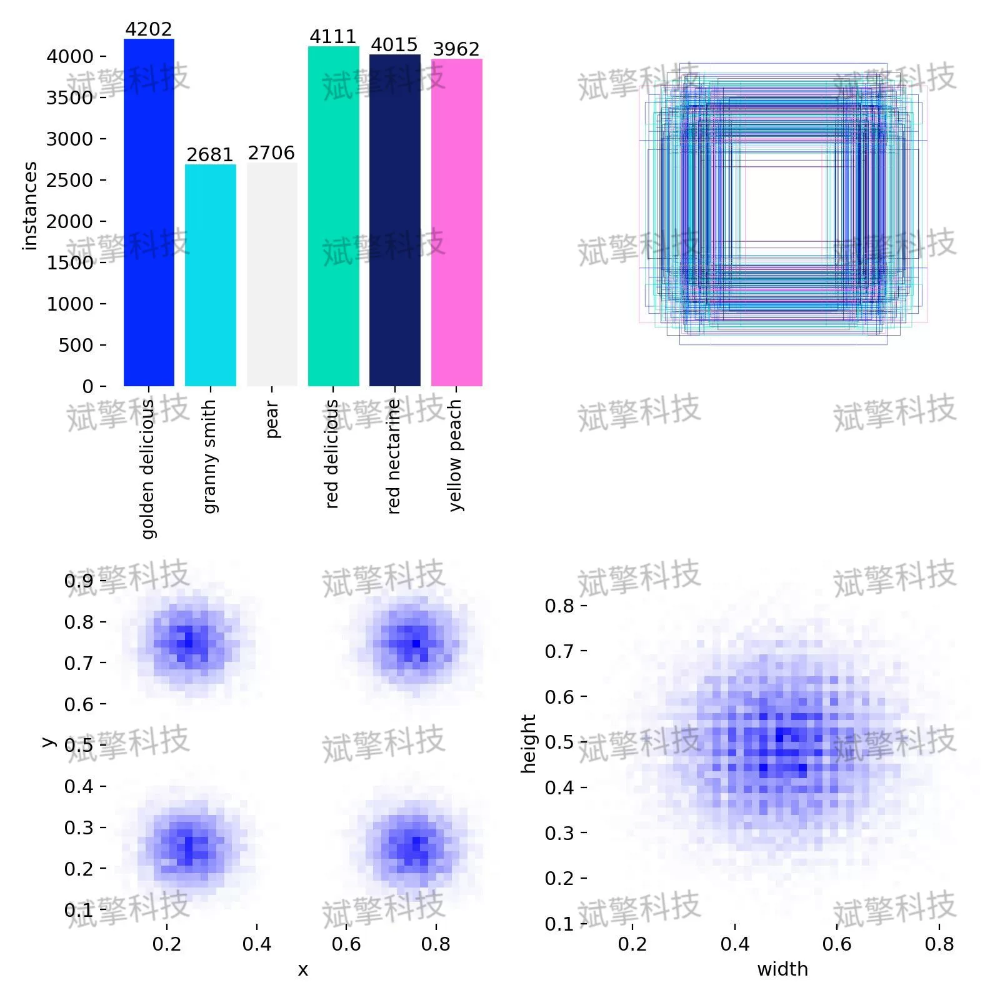
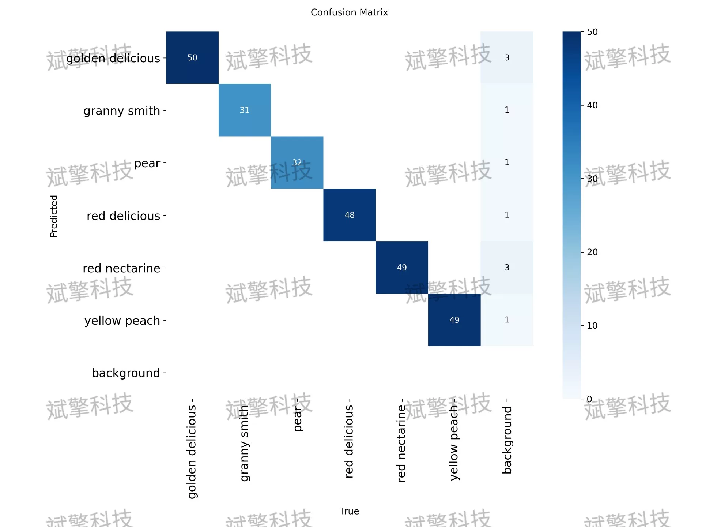
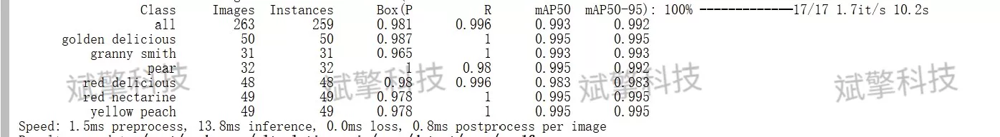
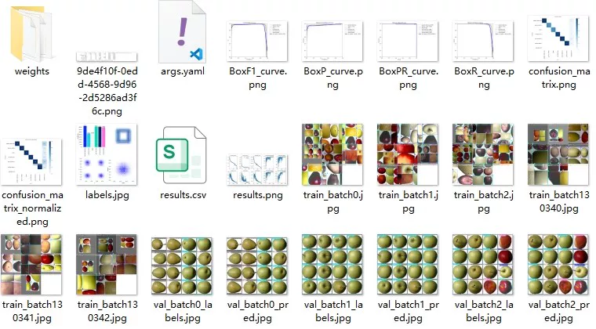
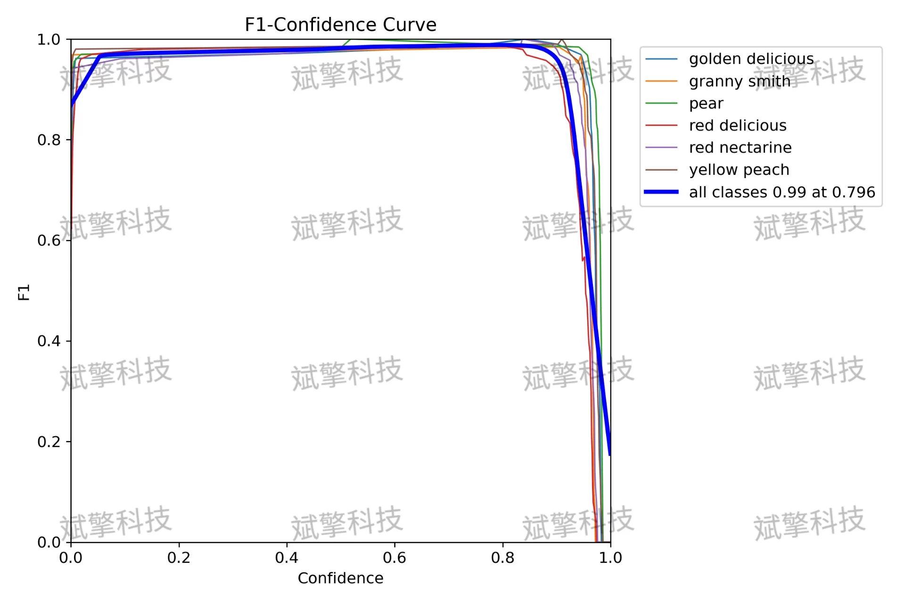
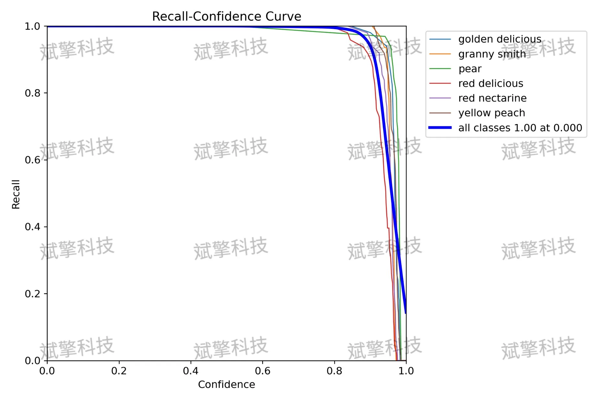
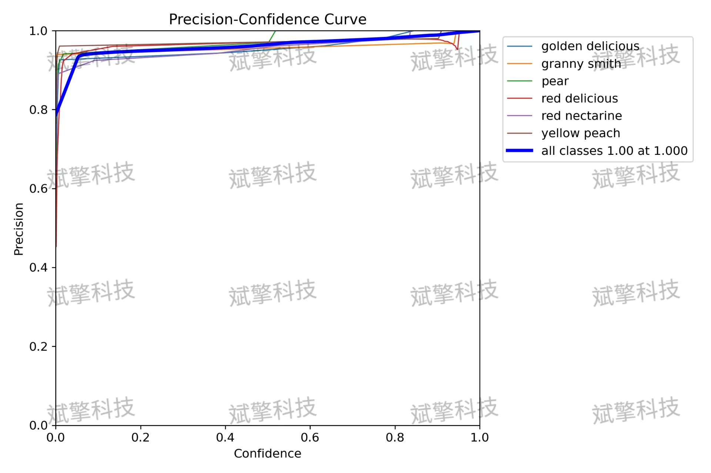

# YOLOv26 Fruit Identification Detection System | Dataset

## Body

YOLO26 Fruit Recognition and Detection System | Dataset Based on the YOLO26 Deep Learning for Fruit Recognition and Detection System (Project Source Code + Dataset + Model Weights + UI Interface + Python + Deep Learning + Remote Environment Deployment)

This article introduces a high-efficiency fruit recognition and detection system based on the YOLO26 architecture, aiming to achieve real-time, accurate detection and classification of various common fruits. The system constructs a specialized dataset for six types of fruits—golden delicious apples, Granny Smith apples, pears, Red Delicious apples, Red Nectarines, and Yellow peaches—and completes model training. Experimental results show that the model performs excellently on the validation set, with an average precision mean mAP50 reaching 0.993 and mAP50-95 reaching 0.992, demonstrating outstanding detection accuracy and localization capabilities. The system not only has high accuracy and recall rates but also operates quickly in inference, suitable for practical scenarios such as agricultural automation, intelligent sorting, retail settlement, etc., with good application prospects and promotional value.

The dataset used in this study was specifically constructed for the task of fruit target detection, containing six common fruits, as follows:
golden delicious (Golden Delicious Apple)
granny smith (Granny Smith Apple)
pear (Pear)
red delicious (Red Delicious Apple)
red nectarine (Red Nectarine)
yellow peach (Yellow Peach)
The dataset consists of 5744 labeled images, including 5481 training images and 263 validation images.

Free reservation for remote installation. Unsuccessful full refund.
Purchase comes with the following resources (Baidu Drive automatically unlocks):
YOLO Recognition and Detection Project Complete Source Code
YOLO format Dataset
Training code + UI interface code
Trained model + result images
Software installer
Add WeChat to make a reservation for remote installation (Automatically display WeChat ID after purchase) - Unsuccessful, full refund guaranteed.

⚙️ Core Function Modules
Detection Capability
Image Detection: Upon upload, return detection boxes + category information
Video Detection: Supports video files, analyzes frames accurately
Camera Real-Time Detection: Connects to USB cameras to achieve dynamic monitoring
Interaction and Control
Target Filtering: Choose one or more categories for detection
Parameter Real-Time Adjustment: Adjustable confidence threshold & IoU threshold, flexible control over precision
Result Saving: One-click save of image/video/camera detection results
System and Data
User Login and Registration: Supports password strength check + encryption storage
Log Recording: Auto-record operation and error information (timestamped)

## Images

## Payment

Here is a pay link on Stripe ( https://buy.stripe.com/3cs8yP7sY87d0vu9AB ). Please contact me lonlonago@foxmail.com after funding $89, and I will send you a complete data files , thank you!

